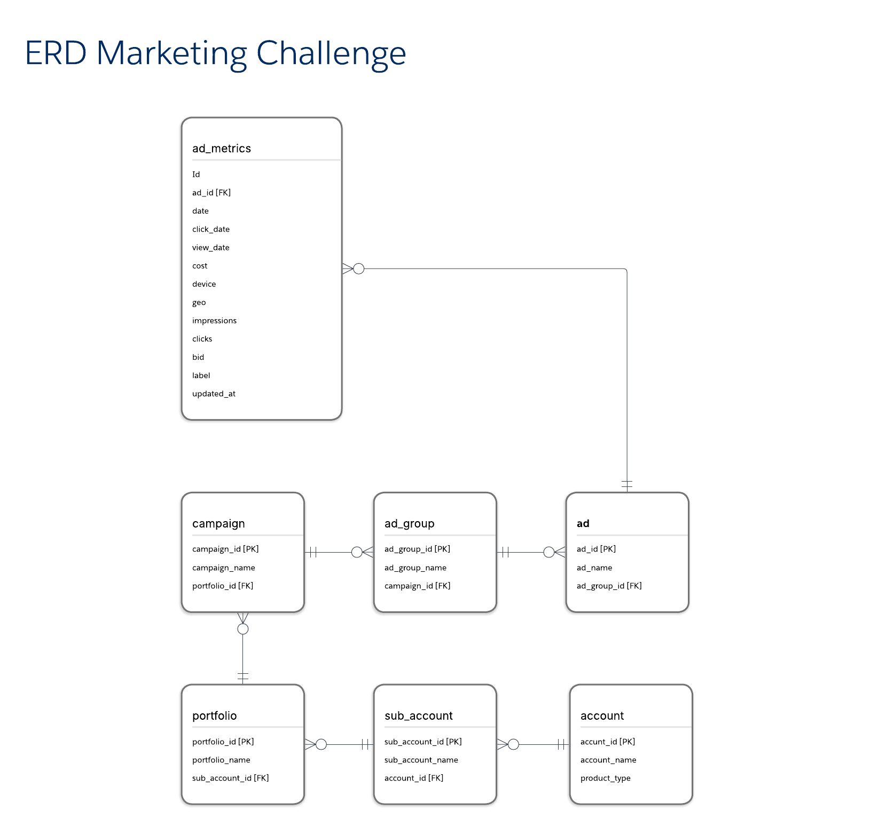

# Section 2 - Marketing Data Modeling Challenge


## ERD Diagram




### SQL Table Criation


<details>

``` sql
-- Create Account Dimension Table
CREATE TABLE account (
    account_id VARCHAR(50) PRIMARY KEY,
    account_name VARCHAR(100) NOT NULL,
    product_type ENUM('Wix', 'Wix Studio') NOT NULL
);

-- Create Sub Account Dimension Table
CREATE TABLE sub_account (
    sub_account_id VARCHAR(50) PRIMARY KEY,
    sub_account_name VARCHAR(100) NOT NULL,
    account_id VARCHAR(50) NOT NULL,
    FOREIGN KEY (account_id) REFERENCES account(account_id)
);

-- Create Portfolio Dimension Table
CREATE TABLE portfolio (
    portfolio_id VARCHAR(50) PRIMARY KEY,
    portfolio_name VARCHAR(100) NOT NULL,
    sub_account_id VARCHAR(50) NOT NULL,
    FOREIGN KEY (sub_account_id) REFERENCES sub_account(sub_account_id)
);

-- Create Campaign Dimension Table
CREATE TABLE campaign (
    campaign_id VARCHAR(50) PRIMARY KEY,
    campaign_name VARCHAR(100) NOT NULL,
    portfolio_id VARCHAR(50) NOT NULL,
    FOREIGN KEY (portfolio_id) REFERENCES portfolio(portfolio_id)
);

-- Create Ad Group Dimension Table
CREATE TABLE ad_group (
    ad_group_id VARCHAR(50) PRIMARY KEY,
    ad_group_name VARCHAR(100) NOT NULL,
    campaign_id VARCHAR(50) NOT NULL,
    FOREIGN KEY (campaign_id) REFERENCES campaign(campaign_id)
);

-- Create Ad Dimension Table
CREATE TABLE ad (
    ad_id VARCHAR(50) PRIMARY KEY,
    ad_name VARCHAR(100) NOT NULL,
    ad_group_id VARCHAR(50) NOT NULL,
    FOREIGN KEY (ad_group_id) REFERENCES ad_group(ad_group_id)
);

-- Create Fact Table for Ad Metrics
CREATE TABLE ad_metrics (
    fact_id BIGINT AUTO_INCREMENT PRIMARY KEY,
    ad_id VARCHAR(50) NOT NULL,
    date DATETIME NOT NULL,
    click_date DATETIME NULL,
    view_date DATETIME NULL,
    cost DECIMAL(10,2) NOT NULL,
    device VARCHAR(50) NOT NULL,
    geo VARCHAR(50) NOT NULL,
    impressions BIGINT NOT NULL,
    clicks BIGINT NOT NULL,
    bid DECIMAL(10,2) NOT NULL,
    label VARCHAR(32) NULL,
    updated_at TIMESTAMP DEFAULT CURRENT_TIMESTAMP ON UPDATE CURRENT_TIMESTAMP,
    FOREIGN KEY (ad_id) REFERENCES ad(ad_id)
);
```

</details>

## Rationale Behind the Modeling Decisions

### Separation of Fact and Dimension Tables
- `ad_metrics` stores measurable event data (impressions, clicks, cost, etc.).
- Dimension tables (`account`, `campaign`, `ad`, etc.) store descriptive attributes to enable efficient filtering and grouping.

### Hierarchical Structure
- The model reflects the natural hierarchy of advertising data, from the **account level** down to **individual ads**.
- Ensures a clear, direct relationship between entities, enabling efficient aggregation and querying.

### Efficient Storage of Frequently Changing Attributes
- Attributes that change frequently (**bid, label**) are kept inside the **fact table** to allow easy updates.
- Slowly changing attributes (**campaign names, account details**) are stored in **dimension tables**.

---

## How the Model Addresses Business Requirements

### Multi-Platform Marketing Data Support
- The model is designed to accommodate data from various advertising platforms (Google Ads, Facebook, TikTok, etc.), despite slight structural variations between them.

### Hierarchical Relationships
- The **account → sub_account → portfolio → campaign → ad_group → ad** structure enables aggregated and detailed reporting.

* Historical Tracking & Real-Time Analysis:
- The `ad_metrics` table stores **daily/hourly** ad performance metrics., making it easy to analyze historical trends.
- The `updated_at` column ensures tracking of recent updates while maintaining historical values.

### Handling High Data Volume
- The schema design **supports partitioning and indexing**, ensuring efficient storage and querying.

---

## Trade-offs Considered and Justifications

| Trade-off | Decision | Reasoning |
|-----------|----------|-----------|
| Storing `device` and `geo` in `ad_metrics` | Stored in `ad_metrics` | These attributes can change per impression/click, making them event-specific. |
| Handling `bid` and `label` (frequently changing attributes) | Stored in `ad_metrics` | Allows easy updates without affecting historical data. |
| Primary Key for `ad_metrics` | Used auto-increment ID (`fact_id`) instead of a composite key | Simpler indexing and better performance for analytical queries. |

---

## How the Model Handles Data Quality Issues (Nulls, Inconsistencies)

### Handling NULL Values in `click_date` and `view_date`
- Since not all platforms provide these fields, we allow **NULL values** and handle missing data with defaulting strategies in queries.

### Ensuring Foreign Key Integrity
- **Foreign key constraints** enforce referential integrity between fact and dimension tables.

### Data Type Constraints
- Fields like `cost`, `impressions`, and `clicks` are **non-nullable**, ensuring no missing data in key metrics.

## Consistency Across Different Platforms:
- **Standardized ffield types and ingestion processes** allow unified reporting across platforms (Google Ads, Facebook, TikTok, etc.).

## Recommendations for Indexing Strategy to Optimize Query Performance

To enhance query performance, indexing is applied to key filtering and join conditions:

### **Primary Indexes**
- Each **dimension table** has a **primary key** (`account_id`, `campaign_id`, etc.).
- `ad_metrics` uses `fact_id` as its primary key.

### **Foreign Key Indexes**
- Indexes on **foreign key columns** (`ad_id`, `campaign_id`) speed up joins between fact and dimension tables.

### **Additional Indexes**
``` sql
-- Indexes for Performance Optimization
CREATE INDEX idx_ad_metrics_date ON ad_metrics(date);
CREATE INDEX idx_ad_metrics_ad_id ON ad_metrics(ad_id);
```

idx_fact_ad_metrics_date → Optimizes queries filtering by date ranges.

idx_fact_ad_metrics_ad_id → Speeds up queries that fetch ad-specific performance data.