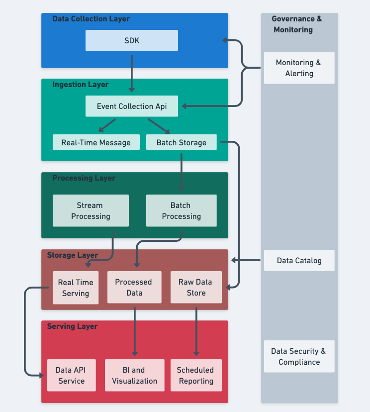

# Section 3 - Architectural Design Challenge

### Overview
The proposed architecture is designed to **collect, process, and analyze** user interaction data from the **Wix comparison chart feature**. The system supports both **real-time analytics** for immediate insights and **batch processing** for comprehensive analysis, while ensuring **scalability, reliability, and compliance** with privacy regulations.

## Architecture

### Architecture Diagram

### Data Collection Layer
#### Client-Side Tracking

- **Technology:** Custom SDK in the relevant UI programming language.
- **Purpose:**  Use SDK in the Wix comparison chart pages to capture user interactions
- **Events Tracked:**
  - Page views.
  - Feature interactions (toggles, filters, sorting).
  - Affiliate link clicks with attribution data.
  - Session information (duration, bounce rate).

---

### Ingestion Layer
#### Event Collection API
- **Technology:** AWS API Gateway.
- **Purpose:** RESTful API endpoints to receive events from the SDK.
- **Features:**
  - Schema validation against predefined event schemas.
  - Rate limiting to prevent abuse.
  - Authentication to ensure valid sources.
  - Compression for bandwidth optimization.

#### Real-Time Message Queue
- **Technology:** Amazon Kinesis Data Streams.
- **Purpose:** Buffer incoming events and enable parallel processing.
- **Features:** Multiple shards/partitions for high throughput.

#### Batch Event Collection
- **Technology:** AWS S3.
- **Purpose:** Collect raw events in compressed JSON files for batch processing.
- **Organization:** Partitioned by date, hour, and event type.

---

### Processing Layer
#### Stream Processing

- **Technology:** Apache Flink on AWS Kinesis Data Analytics.
- **Purpose:** Real-time event processing, enrichment, and aggregation.
- **Processing Logic:**
  - Sessionization (grouping events by user sessions).
  - User segmentation based on Business Analysis team rules.
  - Anomaly detection for unexpected traffic patterns.
  - Enrichment with user context (geography, device, etc.).

#### Batch Processing
- **Technology:** Apache Spark on AWS EMR.
- **Purpose:** Complex aggregations and model building.
- **Jobs:**
  - Daily ETL jobs to transform raw data into analytics-ready tables.
  - Aggregation jobs for reporting dashboards.
  - Feature engineering for machine learning models.
  - Data quality validation checks.

---

### Storage Layer
#### Raw Data Store
- **Technology:** AWS S3.
- **Purpose:** Immutable storage of all collected raw events.
- **Organization:** Partitioned by date, event type, and source.

#### Processed Data
- **Technology:** Snowflake or BigQuery.
- **Purpose:** Structured storage for analytics and reporting.
- **Schema Design:**
  - Dimensional model with **fact and dimension tables**.
  - **Slowly changing dimensions** for user attributes.
  - **Pre-aggregated tables** for common queries.

#### Real-Time Serving Database
- **Technology:** Amazon DynamoDB.
- **Purpose:** Store real-time aggregates and recent events.
- **Access Patterns:**
  - User session lookup.
  - Recent activity tracking.
  - Real-time dashboards data.

---

### Serving Layer
#### Data API Service
- **Technology:** GraphQL API running on AWS AppSync.
- **Purpose:** Provide secure access to processed data.
- **Features:**
  - Authentication and authorization.
  - Rate limiting.
  - Caching for frequent queries.
  - Query optimization.

### BI and Visualization
- **Technology:** Looker, Tableau, or Power BI.
- **Purpose:** Self-service analytics for business users.
- **Dashboards:**
  - Conversion funnel analysis.
  - Comparison chart engagement metrics.
  - Affiliate link performance.
  - A/B test results.

### Scheduled Reporting
- **Technology:** AWS MWAA (Managed Workflows for Apache Airflow).
- **Purpose:** Generate and distribute recurring reports.
- **Reports:**
  - Daily engagement summary.
  - Weekly conversion metrics.
  - Monthly trend analysis.

---

## Governance & Monitoring
### Data Catalog
- **Technology:** AWS Glue Data Catalog.
- **Purpose:** Maintain metadata about all datasets.
- **Features:**
  - Data dictionary.
  - Lineage tracking.
  - Schema evolution history.

### Monitoring & Alerting
- **Technology:** Datadog.
- **Purpose:** Ensure system health and performance.
- **Metrics Tracked:**
  - End-to-end latency.
  - Error rates.
  - Data quality metrics.

### Data Security & Compliance
- **Technology:** Cloud IAM + custom compliance tools.
- **Purpose:** Maintain security and regulatory compliance.
- **Features:**
  - Row-level access control.
  - Data encryption (at rest and in transit).
  - Audit logging.
  - Automatic PII detection and masking.
  - Data retention and purging policies.

## Implementation & Deployment Plan

| Phase | Description |
|------------|---------------------------------------------|
| **Phase 1** | Implement SDK for client-side tracking. |
| **Phase 2** | Set up real-time and batch processing pipelines. |
| **Phase 3** | Build dashboards and self-service analytics. |
| **Phase 4** | Optimize cost, improve monitoring, and scale. |

## Testing Strategy
### Unit Testing:
- Automated tests for all processing components.
- Schema validation tests.
- Edge case handling.

### Integration Testing
- End-to-end data flow validation.
- Cross-component interaction testing.
- Performance under load testing.

## Future Considerations
Machine Learning - Integrate machine learning models for predictive analytics and personalized recommendations.